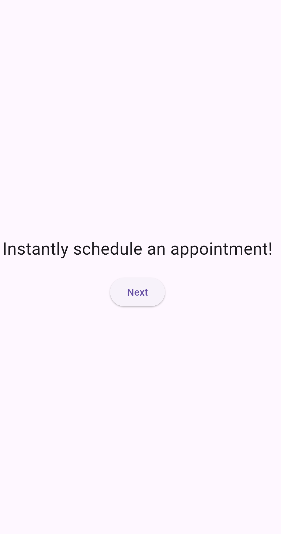
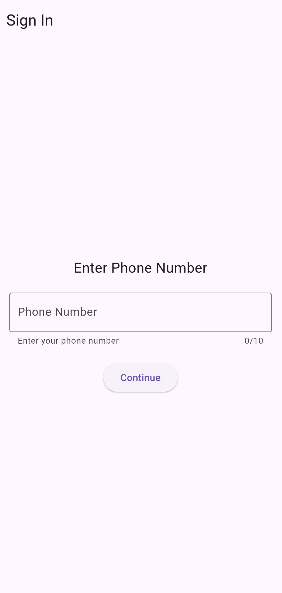
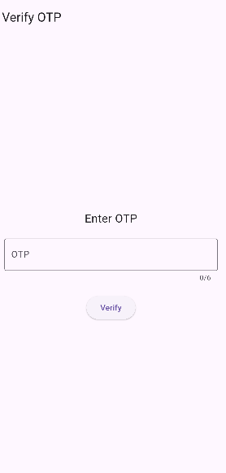
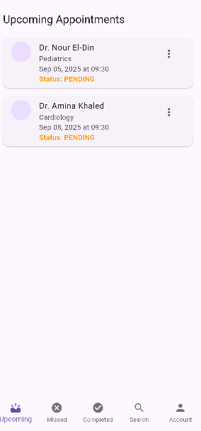
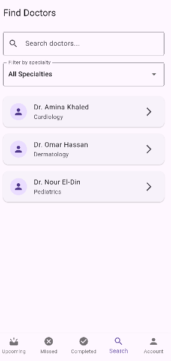
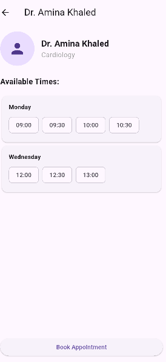
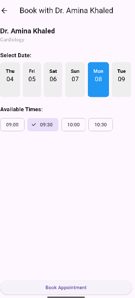
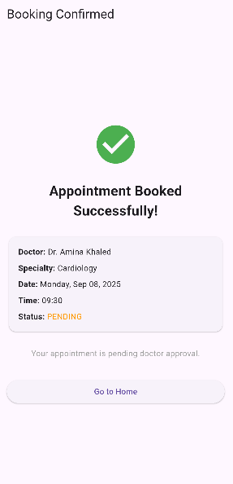
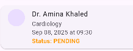
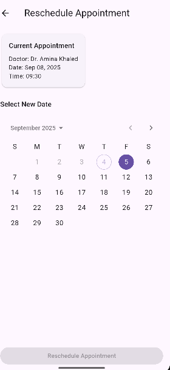

# Appointment Booking App

A comprehensive Flutter application for managing medical appointments between patients and doctors. The app supports dual user roles with distinct interfaces and functionalities for both patients and healthcare providers.

## Features

### Patient Features

- **User Authentication**: Phone number-based authentication with OTP verification
- **Doctor Discovery**: Browse and search available doctors by specialty
- **Appointment Booking**: Schedule appointments with preferred doctors
- **Appointment Management**: View, reschedule, and cancel appointments
- **Real-time Notifications**: Get notified about appointment confirmations and reminders

### Doctor Features

- **Doctor Dashboard**: Manage daily appointments and patient interactions
- **Schedule Management**: View and organize appointment schedules

## Requirements

### System Requirements

- **Flutter SDK**: >=3.0.0 <4.0.0
- **Dart SDK**: >=3.0.0
- **Android**: Android 5.0+
- **Development Environment**: Android Studio

### Dependencies

- `flutter`: Flutter SDK
- `hive`: ^2.2.3 - Local database for data persistence
- `hive_flutter`: ^1.1.0 - Flutter integration for Hive
- `provider`: ^6.1.1 - State management
- `uuid`: ^4.2.1 - Unique identifier generation
- `intl`: ^0.19.0 - Internationalization and date formatting
- `flutter_local_notifications`: ^17.2.2 - Local push notifications
- `timezone`: ^0.9.2 - Timezone handling for appointments

### Development Dependencies

- `hive_generator`: ^2.0.1 - Code generation for Hive models
- `build_runner`: ^2.4.8 - Code generation runner
- `flutter_lints`: ^3.0.0 - Linting rules

## Installation & Setup

### 1. Prerequisites

Ensure you have Flutter installed on your system. If not, follow the [official Flutter installation guide](https://docs.flutter.dev/get-started/install).

### 2. Clone the Repository

```bash
git clone <repository-url>
cd Appointment_app
```

### 3. Install Dependencies

```bash
flutter pub get
```

### 4. Generate Code

Generate the required Hive adapters and other generated files:

```bash
flutter packages pub run build_runner build
```

### 5. Run the Application

```bash
flutter run
```

## Project Structure

```
lib/
├── assets/
│   └── seed/                 # Seed data for initial app setup
├── models/
│   ├── appointment.dart      # Appointment data model
│   ├── doctor.dart          # Doctor data model
│   └── user.dart            # User data model
├── screens/
│   ├── appointments/         # Appointment-related screens
│   ├── auth/                # Authentication screens
│   ├── doctors/             # Doctor-specific screens
│   ├── home/                # Home and main navigation
│   ├── onboarding/          # App introduction screens
│   └── splash/              # Splash screen
├── services/
│   ├── auth_service.dart    # Authentication logic
│   ├── data_service.dart    # Data persistence service
│   ├── notification_service.dart # Push notification handling
│   └── seed_service.dart    # Initial data seeding
├── widgets/                 # Reusable UI components
└── main.dart               # App entry point
```

## App Flows & Screenshots

### 1. Onboarding Flow

New users are introduced to the app through a series of onboarding screens that explain the key features and benefits.

**Screens:**

- Splash Screen
- 
- Onboarding Screen 1
- 
- Onboarding Screen 2
- 
- Onboarding Screen 3
- 


### 2. Authentication Flow

Secure phone number-based authentication with OTP verification ensures user security and easy access.

**Screens:**

- Phone Number Input
- 
- OTP Verification
- 


### 3. Patient Journey

#### 3.1 Home & Doctor Discovery

Patients can browse available doctors and filter by specialty.

**Screens:**

- Home Dashboard
- 
- Doctor List
- 


#### 3.2 Appointment Booking

Streamlined appointment booking process with date and time selection.

**Screens:**

- Book Appointment
- 
- Date & Time Selection
- 
- Booking Confirmation
-


#### 3.3 Appointment Management

Patients can view their upcoming appointments, reschedule, or cancel as needed.

**Screens:**

- Appointment Details
- 
- Reschedule Appointment
- 


### 4. Doctor Journey

#### 4.1 Doctor Dashboard

Doctors have access to a comprehensive dashboard showing their daily schedule and patient appointments.

**Screens:**

- Doctor Dashboard
- Daily Schedule View


#### 4.2 Appointment Management (Doctor View)

Doctors can manage their appointments, view patient details, and update appointment statuses.

**Screens:**

- Appointment Details (Doctor View)
- Patient Information
- Schedule Management


### 5. Notification System

Real-time notifications keep both patients and doctors informed about appointment updates.

**Features:**

- Appointment confirmations
- Reminder notifications
- Schedule changes
- Cancellation alerts


## Data Models

### User Model

- Supports both patient and doctor roles
- Phone number-based identification
- Role-based access control

### Doctor Model

- Professional information (name, specialty)
- Work schedule and availability

### Appointment Model

- Patient-doctor relationship
- Date and time scheduling
- Status tracking (pending, confirmed, completed, cancelled)
- Automatic notifications

## Development Notes

### Local Data Storage

The app uses Hive for local data persistence, providing:

- Fast, lightweight database operations
- Offline functionality
- Type-safe data models with code generation

### State Management

Provider pattern is used for state management, offering:

- Reactive UI updates
- Clean separation of business logic
- Testable architecture

### Notifications

Local notifications are implemented using `flutter_local_notifications` with:

- Timezone-aware scheduling
- Custom notification channels
- Background notification handling

## License

This project is part of the MAIM training graduation program.

---
